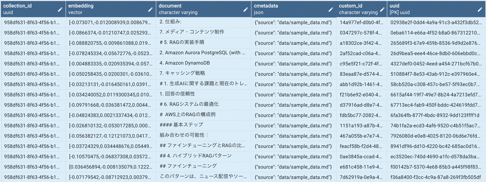

# ローカルRAGプロジェクト

## 概要
このプロジェクトは、ローカル環境でRetrieval-Augmented Generation (RAG) システムを実現することを目的としています。外部APIに依存せずに、効率的な情報検索と生成を可能にし、カスタマイズされた質問応答システムを構築します。

## セットアップ(macOSである前提)

1. リポジトリのクローン：
   ```
   git clone https://github.com/outan/local_rag
   cd local_rag
   ```

1. 仮想環境の作成とアクティベーション：
   ```
   python -m venv rag_env
   source rag_env/bin/activate

1. 依存関係のインストール：
   ```
   pip install -r requirements.txt
   ```

1. PostgreSQLのセットアップ
    - PostgreSQLのインストール：
        ```
        brew install postgresql
        ```
    - PostgreSQLサーバーの起動：
        ```
        brew services start postgresql
        ```
    - pgvectorエクステンションのインストール：
        ```
        brew install pgvector
        ```
    - データベースの作成：
        - PostgreSQLにログイン：
            - PostgreSQLは通常、インストール時にOSのユーザー名と同じ名前のデータベースユーザーを自動的に作成します。
            - `postgres`は、PostgreSQLのデフォルトのシステムデータベースです。すべてのPostgreSQLインスタンスに存在します。
            - psqlコマンドは、引数なしで実行すると、現在のOSユーザー名と同じ名前のデータベースに接続しようとします。`postgres`を指定することで、明示的に`postgres`データベースに接続します。
            ```
            psql postgres
            ```
        - 新しいデータベースを作成：
            ```
            CREATE DATABASE rag_test;
            ```
        - データベースを確認： `rag_test`というdatabaseが作られた
            ```
            \l
                                                            List of databases
            Name    | Owner | Encoding | Locale Provider | Collate | Ctype | ICU Locale | ICU Rules |  Access privileges  
            -----------+-------+----------+-----------------+---------+-------+------------+-----------+---------------------
            postgres  | dan.w | UTF8     | libc            | C       | C     |            |           | 
            rag_test  | dan.w | UTF8     | libc            | C       | C     |            |           | 
            ```
        - `rag_test`に切り替えて、`pgvector`エクステンションを有効化：
            ```
            \c rag_test;
            CREATE EXTENSION vector;

            SELECT * FROM pg_extension;
            oid  | extname | extowner | extnamespace | extrelocatable | extversion | extconfig | extcondition 
            -------+---------+----------+--------------+----------------+------------+-----------+--------------
            14074 | plpgsql |       10 |           11 | f              | 1.0        |           | 
            16705 | vector  |       10 |         2200 | t              | 0.7.4      |           | 
            ```

## プロジェクト構造

- `basic_rag.py`: RAGシステムの主要ロジック
- `vectorstore_preparation.py`: チャンクの分割とベクトルストア作成
- `requirements.txt`: プロジェクト依存関係リスト
- `.gitignore`: バージョン管理除外ファイル指定
- `data/`: サンプルデータ格納ディレクトリ

## 使用方法

1. データ準備：
   - `data/`フォルダにテキストファイル（.txtまたは.md）を配置
   - これらのファイルがRAGシステムの知識ベースとなります

1. ベクトルストア作成：
   ```
   python vectorstore_preparation.py
   ```
   - 対象：`data/`フォルダ内のテキストファイル（.txtまたは.md）が読み込まれる
1. ベクトルストア確認：
`langchain_pg_collection`と`langchain_pg_embedding`の２つのtableが作成される。
    ```
    \dt;
                    List of relations
    Schema |          Name           | Type  | Owner 
    --------+-------------------------+-------+-------
    public | langchain_pg_collection | table | dan.w
    public | langchain_pg_embedding  | table | dan.w
    ```

1. `langchain_pg_collection`:
LangChainライブラリがPGVector（PostgreSQLベクトルデータベース）と連携して使用するテーブル
    ```
    \d langchain_pg_collection;
                Table "public.langchain_pg_collection"
    Column   |       Type        | Collation | Nullable | Default 
    -----------+-------------------+-----------+----------+---------
    name      | character varying |           |          | 
    cmetadata | json              |           |          | 
    uuid      | uuid              |           | not null | 
    
    Indexes:
        "langchain_pg_collection_pkey" PRIMARY KEY, btree (uuid)
    Referenced by:
        TABLE "langchain_pg_embedding" CONSTRAINT "langchain_pg_embedding_collection_id_fkey" FOREIGN KEY (collection_id) REFERENCES langchain_pg_collection(uuid) ON DELETE CASCADE

    select * from langchain_pg_collection;
            name         | cmetadata |                 uuid                 
    ----------------------+-----------+--------------------------------------
    your_collection_name | null      | 958df631-8f63-4f56-b1ce-fa64b66b7d8a
    ```
    - コレクションの定義：
    コレクションは、関連するデータの論理的なグループです。ベクトルデータベースにおいて、類似の目的や特性を持つベクトルの集合を表します。
    - 暗黙的なコレクション作成：
    `PGVector.from_documents()`メソッドを使用する際、`collection_name`パラメータを指定しています
        ```python
        vectorstore = PGVector.from_documents(
            documents=all_texts,
            embedding=embeddings,
            connection_string=CONNECTION_STRING,
            collection_name="your_collection_name"
        )
        ```
    - コレクションの役割：
        - データの論理的な分離：異なるプロジェクトや目的のデータを分けて管理できます。例えば、ニュース記事用、製品説明用、FAQ用など、目的別にコレクションを分けることができます。
        - 検索スコープの制限：特定のコレクション内でのみ検索を行うことで、効率的な検索が可能になります。
        - メタデータの管理：コレクションごとに異なる設定やメタデータを持つことができます。

1. `langchain_pg_embedding`:実際のベクトルデータや文書内容や文書に関するメタデータなどを保管するテーブル
    ```
    \d langchain_pg_embedding;
                Table "public.langchain_pg_embedding"
        Column     |       Type        | Collation | Nullable | Default 
    ---------------+-------------------+-----------+----------+---------
    collection_id | uuid              |           |          | 
    embedding     | vector            |           |          | 
    document      | character varying |           |          | 
    cmetadata     | json              |           |          | 
    custom_id     | character varying |           |          | 
    uuid          | uuid              |           | not null | 
    
    Indexes:
        "langchain_pg_embedding_pkey" PRIMARY KEY, btree (uuid)
    Foreign-key constraints:
        "langchain_pg_embedding_collection_id_fkey" FOREIGN KEY (collection_id) REFERENCES langchain_pg_collection(uuid) ON DELETE CASCADE
    ```
    - langchain_pg_embeddingテーブルの構成：
        - collection_id (uuid型):langchain_pg_collectionテーブルのuuidカラムを参照する外部キー、各埋め込みベクトルがどのコレクションに属しているかを示します。
        - embedding (vector型):<font color="red">テキストの埋め込みベクトル</font>、pgvectorエクステンションによって提供される特殊なデータ型
        - document (character varying型):<font color="red">元のテキストドキュメントの内容</font>
        - cmetadata (json型):ドキュメントに関連するメタデータを JSON 形式で格納。
        userの役職やロールに応じてアクセス制御したい場合のアクセスレベルなどのカスタムメタデータもここに保存
        - サンプルデータ：
        

1. RAGシステム実行：
   ```
   python basic_rag.py
   ```

## 注意事項

- このプロジェクトはローカル環境で動作するように設計されています。
- 大規模なデータセットを扱う場合は、メモリ使用量に注意してください。
- モデルやベクトルデータベースの選択は、パフォーマンスと精度のバランスを考慮して行ってください。


## ライセンス
