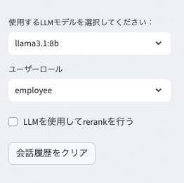
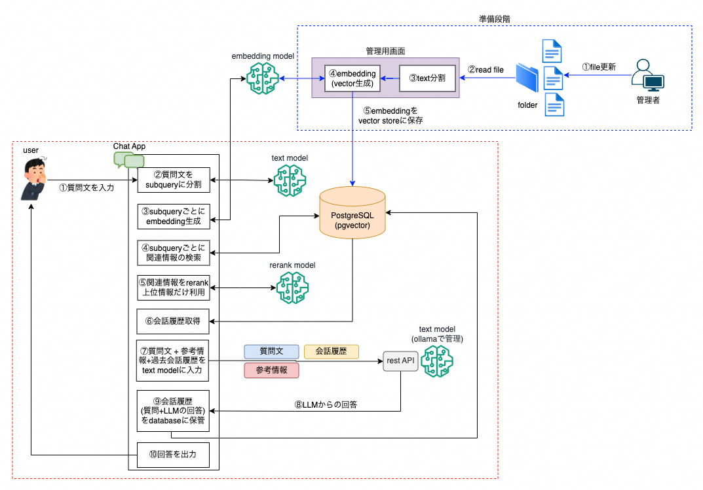

# ローカルRAGプロジェクト

## 1. 概要
このプロジェクトは、`ollama`、`pgvector`、および`LangChain`を使用して、ローカル環境でRetrieval-Augmented Generation (RAG) システムを構築することを目的としています。
- 外部APIに依存せず、テキストの分割、埋め込み生成、ベクトルストアへの保存、効率的な情報検索、LLMによる回答生成までをすべてローカルで完結させます。
- さらに、会話履歴をデータベースに保存し、LLMとの会話時に過去の会話履歴を参照して会話の流れを継続します。
- `Streamlit`を使用してweb画面を構築
    - RAGを利用しない回答とRAGを利用した回答を一つの画面で比較することができます。画面上には、ベクトル変換、ベクトルストアからの関連情報の検索、LLMによる回答生成にかかる時間がそれぞれ表示されます。
    
    
    
    - 画面上でLLMモデル選択可能
    - アプリケーション側(`postgresql`)で会話の履歴を保持していて、過去の会話履歴もLLMにわたすことで、会話のコンテキストを保持できる。「会話履歴をクリア」ボタンで会話履歴を削除可能
    - 「LLMを使用してrerankを行う」ボタンを押すと、LLMを使用して、ベクトルストアから取得した関連テキストチャンクをrerankして、上位数個だけ利用する
    - 「ユーザーロール」を選択すると、ユーザーの役職やロールに応じてアクセス権限持っているコンテンツしかアクセスできないことも制御もできる

## 2. RAGの基本構成

基本的なRAGパターンは、準備段階と利用段階の2つのフェーズで構成されます。

### 2.1 準備段階

- 構成コンポーネント:
    - ナレッジファイルを保持している特定のフォルダ
    - 管理用機能(file取り込み + text分割　+ embedding生成 + ebeddingをvector databaseに保存)
    - 埋め込み（`Embedding`）モデル
    - ベクトルストア(`PostgreSQL`の`pgvector`拡張機能)
    - 会話履歴管理のデータベース(`PostgreSQL`)

- ステップ：
    1. 管理者によるナレッジファイルを更新
    1. `python vectorstore_preparation.py`コマンドを実行し、以下のことを行う
        - file取り込み(特定のフォルダにあるテキストファイルを対象)
        - text分割：
            - 長い文書を適切な長さのチャンクに分割
            - markdownファイルの場合は、header情報もチャンクに追加(header情報にはコンテンツの概要が記載されているため、検索精度を向上させることを目的とする)
        - 埋め込み生成（ベクトル化）：`ollama`で管理されているembedding modelでテキストデータをベクトル表現に変換
        - ベクトルの保存（チャンク単位：**テキスト原文** + **ベクトルデータ** + メタデータ）
        - ファイルの削除、更新も対応：
            - 削除されたファイルはvectorも合わせて削除される
            - 新規ファイルは新しいvectorがvector storeに追加される
            - 更新されたファイルは、古いvectorが削除され、最新のvectorがvector storeに追加される


### 2.2 利用段階

- 構成コンポーネント:
   - チャットアプリケーション
   - 埋め込みモデル
   - ベクトルストア
   - LLMモデル

- ステップ:
   1. ユーザーがチャットアプリから質問文を入力
   1. 質問文をLLMで複数のsubqueryに自動的に分割
   1. それぞれのsubqueryをembedding modelでベクトル化
   1. ベクトル化された質問文を使用してベクトルデータベースから関連テキストチャンク>を検索、取得(多めに取得しておく)
   1. 取得した関連テキストチャンクをrerank modelで再度順番を並び替えて、上位数個だけ利用する
   1. databaseから過去の会話履歴を取得
   1. rerank後の**複数のテキストチャンク**と質問文、過去の会話履歴をLLMに入力
   1. LLMが回答を生成
   1. 会話履歴をdatabaseに保存
   1. ユーザーに回答を出力


## 3. セットアップ(macOSである前提)

1. リポジトリのクローン：
   ```
   git clone https://github.com/outan/local_rag
   cd local_rag
   ```

1. 仮想環境の作成とアクティベーション：
   ```
   python -m venv rag_env
   source rag_env/bin/activate

1. 依存関係のインストール：
   ```
   pip install -r requirements.txt
   ```

1. PostgreSQLのセットアップ
    - PostgreSQLのインストール：
        ```
        brew install postgresql
        ```
    - PostgreSQLサーバーの起動：
        ```
        brew services start postgresql
        ```
    - pgvectorエクステンションのインストール：
        ```
        brew install pgvector
        ```
    - データベースの作成：
        - PostgreSQLにログイン：
            - PostgreSQLは通常、インストール時にOSのユーザー名と同じ名前のデータベースユーザーを自動的に作成します。
            - `postgres`は、PostgreSQLのデフォルトのシステムデータベースです。すべてのPostgreSQLインスタンスに存在します。
            - psqlコマンドは、引数なしで実行すると、現在のOSユーザー名と同じ名前のデータベースに接続しようとします。`postgres`を指定することで、明示的に`postgres`データベースに接続します。
            ```
            psql postgres
            ```
        - 新しいデータベースを作成：
            ```
            CREATE DATABASE rag_test;
            ```
        - データベースを確認： `rag_test`というdatabaseが作られた
            ```
            \l
                                                            List of databases
            Name    | Owner | Encoding | Locale Provider | Collate | Ctype | ICU Locale | ICU Rules |  Access privileges  
            -----------+-------+----------+-----------------+---------+-------+------------+-----------+---------------------
            postgres  | dan.w | UTF8     | libc            | C       | C     |            |           | 
            rag_test  | dan.w | UTF8     | libc            | C       | C     |            |           | 
            ```
        - `rag_test`に切り替えて、`pgvector`エクステンションを有効化：
            ```
            \c rag_test;
            CREATE EXTENSION vector;

            SELECT * FROM pg_extension;
            oid  | extname | extowner | extnamespace | extrelocatable | extversion | extconfig | extcondition 
            -------+---------+----------+--------------+----------------+------------+-----------+--------------
            14074 | plpgsql |       10 |           11 | f              | 1.0        |           | 
            16705 | vector  |       10 |         2200 | t              | 0.7.4      |           | 
            ```

1. 環境変数の準備
`.env_sample`ファイルをコピーして、`.env`ファイルを作成して、必要に応じて内容を修正
    ```
    DB_NAME=rag_test
    DB_USER=<your username> (OSのユーザー名と同じ名前のデータベースユーザーを自動的に作成)
    DB_PASSWORD=<your password> (デフォルトはpasswordなしです)
    DB_HOST=localhost
    DB_PORT=5432
    ```

1. テーブルのスキーマ作成
    ```
    python db_setup.py
    ```
    - `conversation_history`テーブル：
      - `rag_conversation_history`と`no_rag_conversation_history`はそれぞれRAGシステムを使用した場合と使用しない場合の会話履歴を保存するためのカラムです。
    - `file_hashes`テーブル：
      - ナレッジファイルのハッシュ値を保存するためテーブル
      - `python vectorstore_preparation.py`を実行する時に、ファイルの更新と削除も対応するために、ファイルのハッシュ値を保存する必要がある

1. `Ollama`のインストールと起動
- `Ollama`とは
    - ローカル環境で大規模言語モデル（LLM）を簡単に実行できるオープンソースのツール
    - LangChainなどのフレームワークと組み合わせて使用することで、RAGシステムやその他のAIアプリケーションを構築可能
- インストール：
    ```
    brew install ollama
    ```
- `Ollama`サーバーを起動、APIエンドポイントを公開
    - バックグラウンドでモデルを実行、11434 portでリッスンし、HTTPリクエストを受け付けます
    ```
    ollama serve
    ```

## 4. プロジェクト構成

- `basic_rag.py`: RAGシステムの主要ロジック
- `basic_rag_streamlit.py`: RAGシステムの主要ロジック(Streamlitを使用)
- `vectorstore_preparation.py`: チャンクの分割とベクトルストア作成
- `db_setup.py`: 会話履歴保存用のテーブルのスキーマ作成
- `requirements.txt`: プロジェクト依存関係リスト
- `.gitignore`: バージョン管理除外ファイル指定
- `data/`: サンプルデータ格納ディレクトリ
- `.env`: 環境変数

## 5. 使用方法

1. ドキュメントの準備：
   - `data/`フォルダにテキストファイル（`.txt`または`.md`）を配置
   - これらのファイルがRAGシステムの知識ベースとなります

1. ベクトルストア作成とサンプルドキュメントのベクトル化：
   ```
   python vectorstore_preparation.py
   ```
   - vector保存用のテーブルが自動作成される
   - `data/`フォルダ内のテキストファイルが読み込まれ、embedding modelでベクトル化されて、vector storeに保存さ

1. ベクトルストア確認：
`langchain_pg_collection`と`langchain_pg_embedding`の２つのtableが作成される。
    ```
    \dt;
                    List of relations
    Schema |          Name           | Type  | Owner 
    --------+-------------------------+-------+-------
    public | langchain_pg_collection | table | dan.w
    public | langchain_pg_embedding  | table | dan.w
    ```

1. `langchain_pg_collection`:
LangChainライブラリがPGVector（PostgreSQLベクトルデータベース）と連携して使用するテーブル
    ```
    \d langchain_pg_collection;
                Table "public.langchain_pg_collection"
    Column   |       Type        | Collation | Nullable | Default 
    -----------+-------------------+-----------+----------+---------
    name      | character varying |           |          | 
    cmetadata | json              |           |          | 
    uuid      | uuid              |           | not null | 
    
    Indexes:
        "langchain_pg_collection_pkey" PRIMARY KEY, btree (uuid)
    Referenced by:
        TABLE "langchain_pg_embedding" CONSTRAINT "langchain_pg_embedding_collection_id_fkey" FOREIGN KEY (collection_id) REFERENCES langchain_pg_collection(uuid) ON DELETE CASCADE

    select * from langchain_pg_collection;
            name         | cmetadata |                 uuid                 
    ----------------------+-----------+--------------------------------------
    your_collection_name | null      | 958df631-8f63-4f56-b1ce-fa64b66b7d8a
    ```
    - コレクションの定義：
    コレクションは、関連するデータの論理的なグループです。ベクトルデータベースにおいて、類似の目的や特性を持つベクトルの集合を表します。
    - 暗黙的なコレクション作成：
    `PGVector.from_documents()`メソッドを使用する際、`collection_name`パラメータを指定しています
        ```python
        vectorstore = PGVector.from_documents(
            documents=all_texts,
            embedding=embeddings,
            connection_string=CONNECTION_STRING,
            collection_name="your_collection_name"
        )
        ```
    - コレクションの役割：
        - データの論理的な分離：異なるプロジェクトや目的のデータを分けて管理できます。例えば、ニュース記事用、製品説明用、FAQ用など、目的別にコレクションを分けることができます。
        - 検索スコープの制限：特定のコレクション内でのみ検索を行うことで、効率的な検索が可能になります。
        - メタデータの管理：コレクションごとに異なる設定やメタデータを持つことができます。

1. `langchain_pg_embedding`:実際のベクトルデータや文書内容や文書に関するメタデータなどを保管するテーブル
    ```
    \d langchain_pg_embedding;
                Table "public.langchain_pg_embedding"
        Column     |       Type        | Collation | Nullable | Default 
    ---------------+-------------------+-----------+----------+---------
    collection_id | uuid              |           |          | 
    embedding     | vector            |           |          | 
    document      | character varying |           |          | 
    cmetadata     | json              |           |          | 
    custom_id     | character varying |           |          | 
    uuid          | uuid              |           | not null | 
    
    Indexes:
        "langchain_pg_embedding_pkey" PRIMARY KEY, btree (uuid)
    Foreign-key constraints:
        "langchain_pg_embedding_collection_id_fkey" FOREIGN KEY (collection_id) REFERENCES langchain_pg_collection(uuid) ON DELETE CASCADE
    ```
    - langchain_pg_embeddingテーブルの構成：
        - collection_id (uuid型):langchain_pg_collectionテーブルのuuidカラムを参照する外部キー、各埋め込みベクトルがどのコレクションに属しているかを示します。
        - embedding (vector型):<font color="red">テキストの埋め込みベクトル</font>、pgvectorエクステンションによって提供される特殊なデータ型
        - document (character varying型):<font color="red">元のテキストドキュメントの内容</font>
        - cmetadata (json型):ドキュメントに関連するメタデータを JSON 形式で格納。
        userの役職やロールに応じてアクセス制御したい場合のアクセスレベルなどのカスタムメタデータもここに保存
        - サンプルデータ：
        

1. RAGシステム実行：
    1. 普通のバージョン：

    ```shell
    python basic_rag.py
    ```

    1. Streamlit使用バージョン：

    ```shell
    streamlit run basic_rag_streamlit.py
    ```

## 6. 注意事項

- このプロジェクトはローカル環境で動作するように設計されています。
- このプロジェクトはローカル環境での動作確認を目的としており、コードはリファクタリングされており、CSS関連の部分も分離されています。
- 大規模なデータセットを扱う場合は、メモリ使用量に注意してください。
- モデルやベクトルデータベースの選択は、パフォーマンスと精度のバランスを考慮して行ってください。
